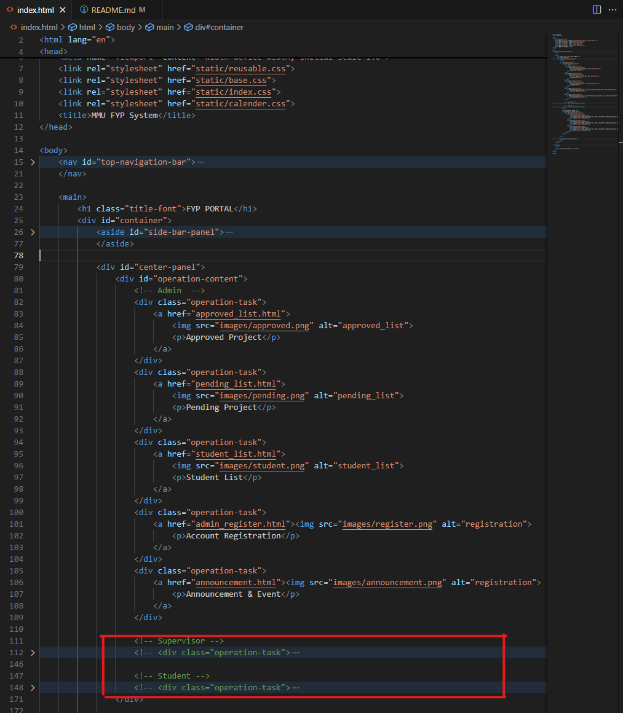

## Getting Started

These instructions will give you a copy of the project up and running on
your local machine for development and testing purposes. 

A step by step series of examples that tell you how to get a development
environment running. If you already have the downloaded file, you can skip
the "clone repository".

### Clone repository 

    git clone https://github.com/JaydenKu03/MMU-FYP-System.git

### Run the file
- The index.html is the main page of our website, click it to run

### Extra Note
- The main page has slight variations depending on the user's role. You can identify these differences by checking the commented sections in the index.html file. For now, you can manually uncomment these sections to view the content for each role. In Part 2 of the assignment, we will use PHP to dynamically render these sections based on user roles.

